- title : Exploring StackOverflow 
- description : Exploring StackOverflow with F# and R.
- author : Evelina Gabasova
- theme : white
- transition : none

***

- data-background : images/copypaste-bg.jpg

<table>
<tr>
  <td class="noborder" style="width:60%;">
  </td> 
  <td class="noborder" style="width:40%;">

<h2> 
 Evelina Gabasova 
 </h2>
@evelgab  
evelinag.com 
github.com/evelinag

</td>

</tr>
</table>

------------------------------------------------------------------------------------------------

<h2> Exploring </h2>  

  
<h2 style="color: #e3650c"> Evelina Gabasova </h2>
@evelgab 

------------------------------------------------------------------------------------------------

<h2> Exploring </h2>  

  
<h2 style="color: #e3650c"> Evelina Gabasova </h2>
@evelgab 

------------------------------------------------------------------------------------------------

- data-background : images/cambridge1.jpg

------------------------------------------------------------------------------------------------

- data-background : images/cambridge2.jpg

------------------------------------------------------------------------------------------------

- data-background : images/cancer-unit.jpg

------------------------------------------------------------------------------------------------

' Why analyze StackOverflow?
' Why not? The data are there
' Can we actually learn something from it?

------------------------------------------------------------------------------------------------

------------------------------------------------------------------------------------------------

------------------------------------------------------------------------------------------------

- data-background : black

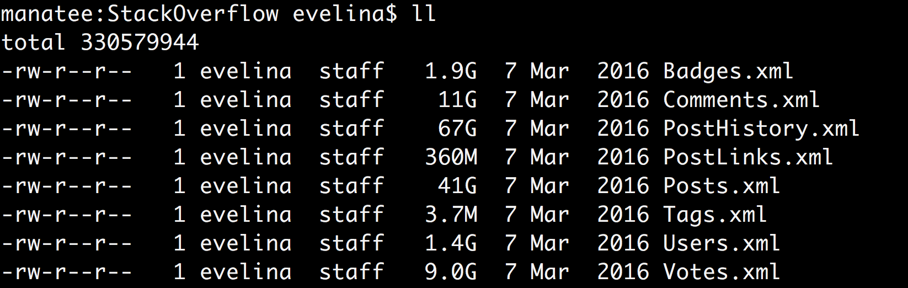

' 135 GB approx

------------------------------------------------------------------------------------------------

<h1 style="font-size:200pt"> ? </h1>

' Questions are important - parallel from genomics

------------------------------------------------------------------------------------------------

- data-background : black

------------------------------------------------------------------------------------------------

- data-background : images/dafuq.png

------------------------------------------------------------------------------------------------

- data-background : #f68024

# Ask questions! 

------------------------------------------------------------------------------------------------

------------------------------------------------------------------------------------------------

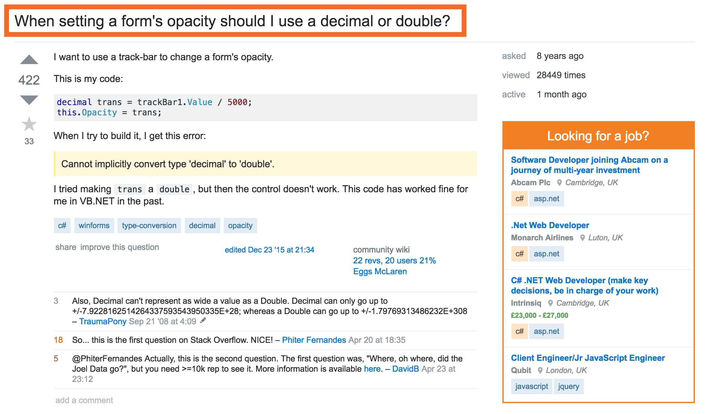

------------------------------------------------------------------------------------------------

------------------------------------------------------------------------------------------------

# Tags

- What are the most common tags?

' how to recognize technologies that people use for hobby projects
' technology: F#, xml parsing
' insights: think about your target demographics
' fun: minecraft, Krzysztof, most corporate technologies

------------------------------------------------------------------------------------------------

------------------------------------------------------------------------------------------------

# Tags

- What are the most common tags?

- When do people ask questions?

------------------------------------------------------------------------------------------------

- data-background : #f68024

# Question: When?

' demo
' tags-time-full.csv
' Show csv type provider, don't run it
' Remark on distributed computing!!! Don't do serious data science on a laptop, unless you're using it to connect to a server/cluster

------------------------------------------------------------------------------------------------

------------------------------------------------------------------------------------------------

------------------------------------------------------------------------------------------------

- data-background : #f68024

# Side projects?

------------------------------------------------------------------------------------------------

- data-background : #f68024 

------------------------------------------------------------------------------------------------

- data-background : #f68024 

------------------------------------------------------------------------------------------------

- data-background : #f68024

' TODO: image of the concept

------------------------------------------------------------------------------------------------

### Functional languages

------------------------------------------------------------------------------------------------

### Continuous integration 

------------------------------------------------------------------------------------------------

 
  

 
# Who's your target user? 

' Do you want people to use your product in their free time?  Make it easy for them
' But targeting enterprise is a valid goal as well

************************************************************************************************

<h1 style="font-size:200pt"> ? </h1>

------------------------------------------------------------------------------------------------

------------------------------------------------------------------------------------------------

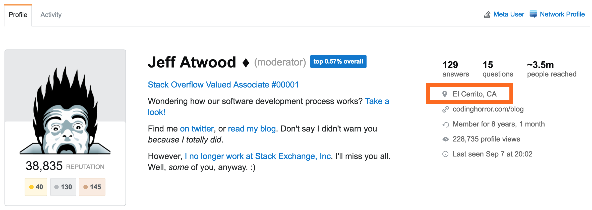

------------------------------------------------------------------------------------------------

# Question: Where?

' Are there local pockets for some of the languages?
' Where is each technology used?
' technology: type providers for JSON & Bing, HTML & Wikipedia, charting
' insights: technology countries, where are programmers concentrated

------------------------------------------------------------------------------------------------

# Where?

- 5 277 833 users in total

- 769 541 filled in their location

------------------------------------------------------------------------------------------------

- data-background : black

------------------------------------------------------------------------------------------------

- data-background : black

### $HOME

------------------------------------------------------------------------------------------------

# 83%

------------------------------------------------------------------------------------------------

- data-background : black

### (Unfortunately) Germany

------------------------------------------------------------------------------------------------

- data-background : black

### 7151 Mawson Station, Australian Antarctic Territory, Antarctica

------------------------------------------------------------------------------------------------

- data-background : images/antarctica.jpg

------------------------------------------------------------------------------------------------

- data-background : #f68024

' demo: JSON type provider + Bing map API

------------------------------------------------------------------------------------------------

- data-background : images/universe.jpg

------------------------------------------------------------------------------------------------
 
# Where?

------------------------------------------------------------------------------------------------

$$$
n \times \frac{1}{\text{population}} \times \frac{\text{registered}}{\text{located}}  \times 1,000,000

 
 

 
### ppm (Programmers-per-million) 

------------------------------------------------------------------------------------------------

- data-background : #f68024

' we need population
' demo: HTML type provider

------------------------------------------------------------------------------------------------

#### C#

------------------------------------------------------------------------------------------------

#### F#

------------------------------------------------------------------------------------------------

- data-background : images/dominican-republic.jpg

------------------------------------------------------------------------------------------------

- data-background : black

## (Sampling bias)

' only registered users
' only active users
' and out of them, only the ones that gave out their address

************************************************************************************************

# Tags + Users

# = 
# Communities

' Users ask questions with specific tags & answer questions with specific tags
' No-one knows everything

' how to define relation between tags through posts & users, similar users - similar tags
' memory vs. distributed computing
' t-SNE visualization - how to create a meaningful visualization
' Networks
' technology: RProvider, Fable

------------------------------------------------------------------------------------------------

# Tags 

### define 

# relations

------------------------------------------------------------------------------------------------

|           | F# | C# | JS | R | Cobol |
|-----------|----|----|------------|---|---|
| Evelina   | 1  | 0  | 1          | 1 | 0 |
| Krzysztof | 1  | 1  | 1          | 0 | 0 |

------------------------------------------------------------------------------------------------

### 44 265 tags x  5 277 831 users

------------------------------------------------------------------------------------------------

#### Users with more than 1,000 posts
#### Tags with more than 5,000 posts

## 807 tags, 1633 power users

------------------------------------------------------------------------------------------------

# t-SNE
## t-distributed Stochastic Neighbourhood embedding

' image
' run t-sne on my desktop at work

------------------------------------------------------------------------------------------------

- data-background: images/part1-once.gif

------------------------------------------------------------------------------------------------

- data-background: images/part1-1.png

------------------------------------------------------------------------------------------------

- data-background: images/part1-2.png

------------------------------------------------------------------------------------------------

- data-background: images/part1-3.png

------------------------------------------------------------------------------------------------

- data-background: images/part1-4.png

------------------------------------------------------------------------------------------------

- data-background: images/part2-once.gif

------------------------------------------------------------------------------------------------

- data-background: images/part2-1.png

------------------------------------------------------------------------------------------------

- data-background: images/part2-2.png

------------------------------------------------------------------------------------------------

- data-background: images/part2-3.png

------------------------------------------------------------------------------------------------

- data-background: images/part2-4.png

------------------------------------------------------------------------------------------------

# t-SNE in R

    [lang=R]
    library(tsne)

    ts <- tsne(m, perplexity=20)

    plot(ts)

------------------------------------------------------------------------------------------------

# t-SNE in F#

    open RProvider
    open RProvider.tsne(tsne)

    let ts = R.tsne(namedParams[ "X", box m; "perplexity", box 20])

    R.plot(ts)

------------------------------------------------------------------------------------------------

- data-background : images/rplot.png

------------------------------------------------------------------------------------------------

*The best thing about R is that it was written by statisticians. The worst thing about R is that it was written by statisticians.*

 

Bow Cowgill, 2009

------------------------------------------------------------------------------------------------

- data-background : images/tsne-full.png

------------------------------------------------------------------------------------------------

------------------------------------------------------------------------------------------------

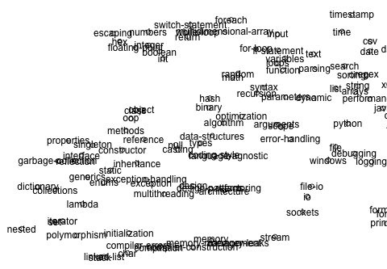

------------------------------------------------------------------------------------------------

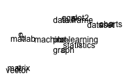

------------------------------------------------------------------------------------------------

------------------------------------------------------------------------------------------------

[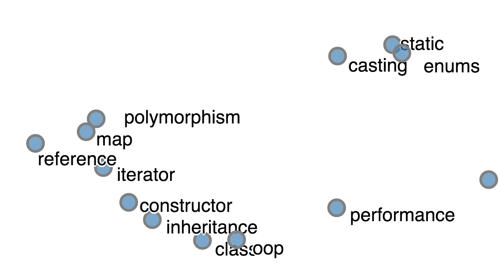](images/tsne-2.html)

' that's why it's good to have a proper language at hand as well!
' TODO visualization with D3

------------------------------------------------------------------------------------------------

# Quantifying Communities

' image showing how we can define a network using user data

------------------------------------------------------------------------------------------------

------------------------------------------------------------------------------------------------

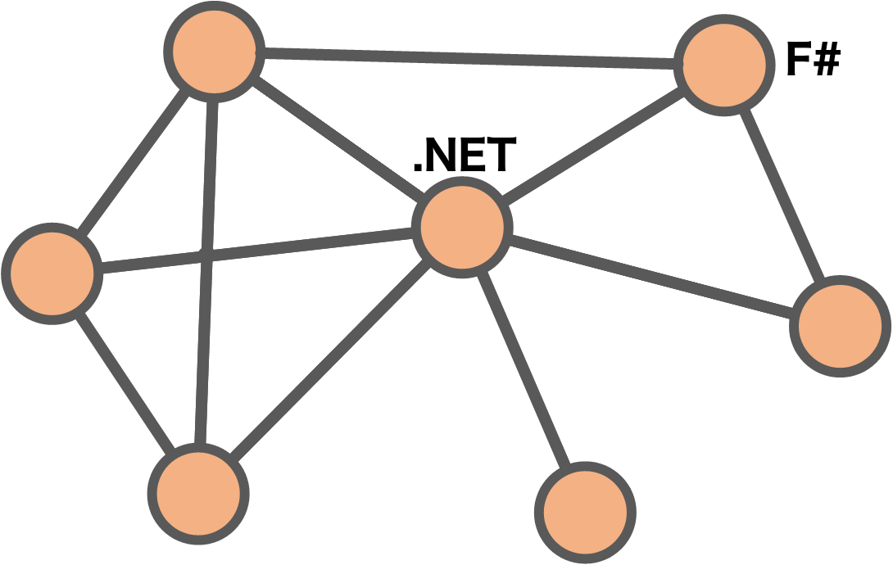

------------------------------------------------------------------------------------------------

------------------------------------------------------------------------------------------------

# No overlap

### iOS  - R
### Django - middleware

' So that when someone comes and says: I want someone to write a statistics app for iphone - now you know that one person knowing both is very rare to find
' Or they are avoidint StackOverflow

------------------------------------------------------------------------------------------------

# Most Central
### Based on number of connections

1. arrays 
2. string 
3. performance

------------------------------------------------------------------------------------------------

# Communities
### Clustering of nodes in a network

' idea of algorithms

------------------------------------------------------------------------------------------------

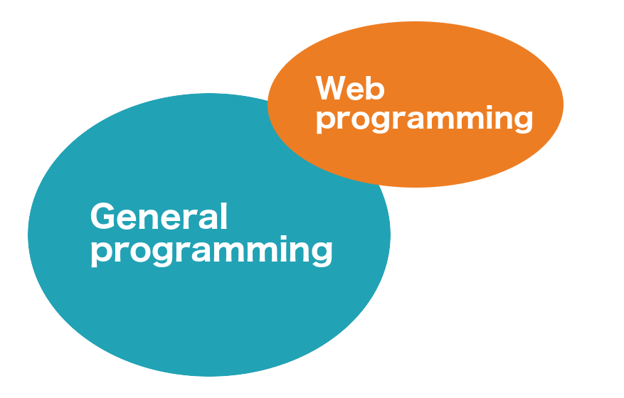

(depending on algorithm used)

------------------------------------------------------------------------------------------------

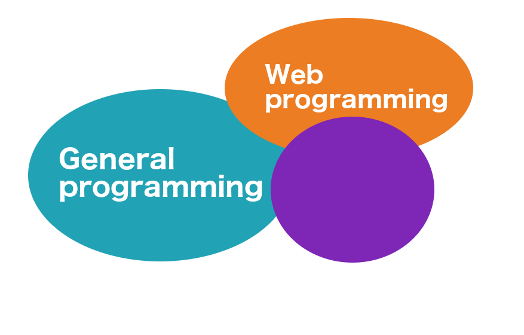

(depending on algorithm used)

------------------------------------------------------------------------------------------------

(depending on algorithm used)

************************************************************************************************

## ✔ Tags 
## ✔ Users
## ✔ Technologies

 

# Questions and Answers

------------------------------------------------------------------------------------------------

## Is

## a meritocracy?

' now a provocative question
' How would we recognize meritocracy? Well, if you come and give a good answer, then you get higher score and reputation for your answer
' So I'll look at how good is author's reputation and other author properties related to the score of the question he answered

------------------------------------------------------------------------------------------------

------------------------------------------------------------------------------------------------

------------------------------------------------------------------------------------------------

# Machine learning

<table>
<tr>
<td class="noborder" style="width:50%;">

## Unsupervised

- Clustering
- Anomaly detection
- ...

*Data exploration*

</td>
<td class="noborder" style="width:50%;">

## Supervised

- Classification
- Regression
- ...

*Prediction*

</td>
</tr>
</table>

------------------------------------------------------------------------------------------------

# Regression 

### input data
# ⬇
### score

------------------------------------------------------------------------------------------------

# Input data 

18,100,293 rows

"Accepted" 
"Question Score" 
"Number of tags" 
"Answer Count"           
"Comment Count"           
"Question Favorite Count"
"Question View Count"     
"Author Reputation"      
"Author Profile Views"    
"Author Up Votes"        
"Author Down Votes"       
"Gold Badges"            
"Silver Badges"           
"Bronze Badges"          
"Author Number of Tags"   
"Time to Answer"        

# ⬇ 

"Score"  

------------------------------------------------------------------------------------------------

## Linear and non-linear Regression

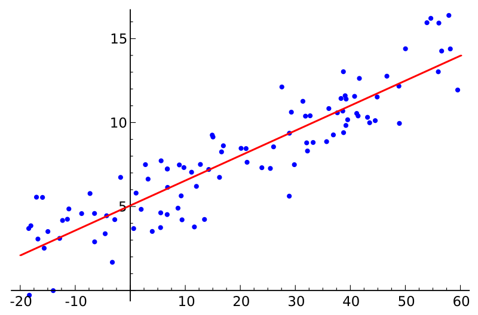

------------------------------------------------------------------------------------------------

## Power-law distributions

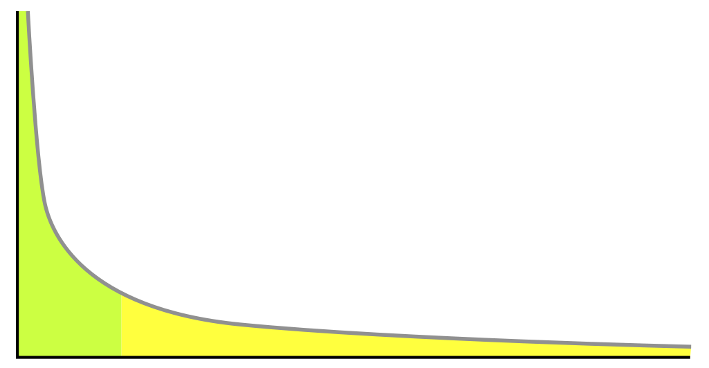

------------------------------------------------------------------------------------------------

# Most predictive

- Accepted
- Favourites

' TODO: Regenerate data with correct time to answer

------------------------------------------------------------------------------------------------

 - data-background : images/chucknorrisapproves.gif

------------------------------------------------------------------------------------------------

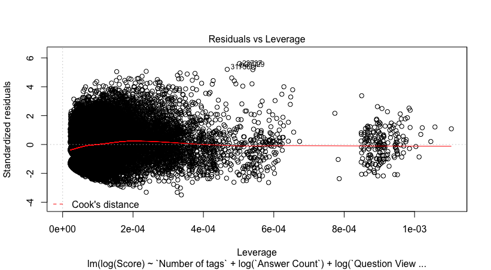

------------------------------------------------------------------------------------------------

------------------------------------------------------------------------------------------------

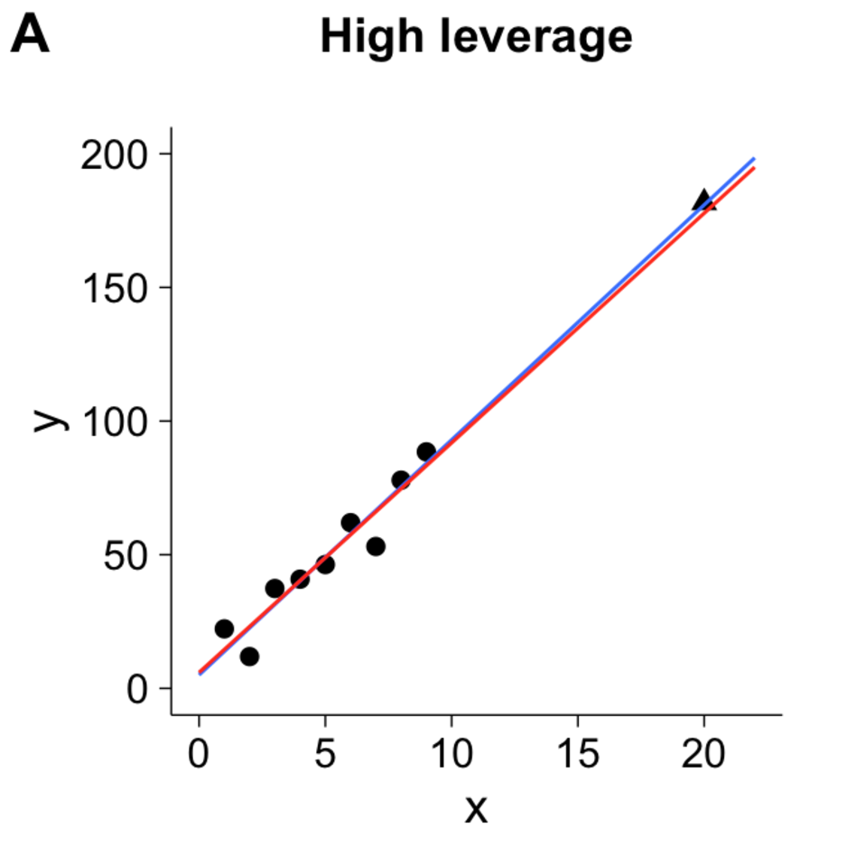

' The 'Jon Skeet' effect
' The reputation is not really important, unless you are Jon Skeet

------------------------------------------------------------------------------------------------

------------------------------------------------------------------------------------------------

- data-background : #f68024

## Quality of answer matters!

### ... unless you are Jon Skeet

************************************************************************************************

' Summary

# Technological side of things

' Data science is about a lot of things - from preprocessing the data, through mathematical models, to visualization
' No single tool - but type providers are a great thing that basically make external data sources a part of your IDE

### Tool for the job

------------------------------------------------------------------------------------------------

' Summary

# Data science side of things
### Questions

------------------------------------------------------------------------------------------------

- Hobby projects vs. enterprise
- Communities
- Help others

- Move to the Dominican republic

' think about your demographics - who are you targetting with your product
' if you're doing .NET - there's a world out there! And if you're doing JavaScript - it's not the only thing in the world!
' help people on StackOverflow - what matters is that answers are helpful, not who they come from (unless...)
' and if you want to do digital nomad thing - you can gather data where you can find likely minded people
' Sampling bias!!!

------------------------------------------------------------------------------------------------

- data-background : images/beach.jpg

<table>
<tr>
  <td class="noborder" style="width:60%;"></td>
   <td class="noborder" style="width:4%;">

<h2> 
 Evelina Gabasova 
 </h2>

@evelgab  
evelinag.com 

      
</td> 
</tr>
</table>